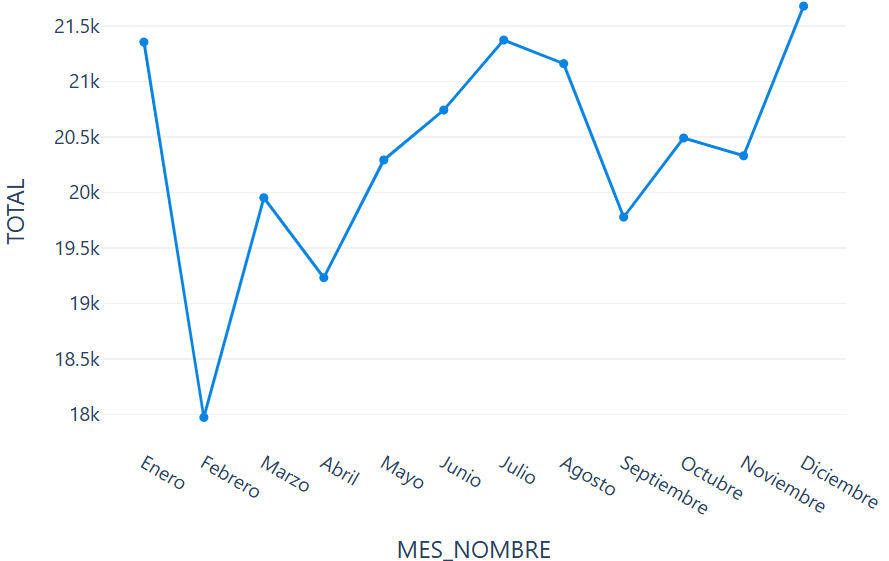
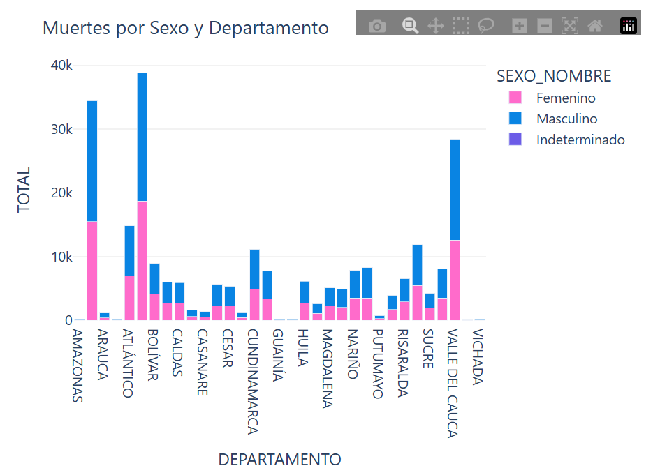
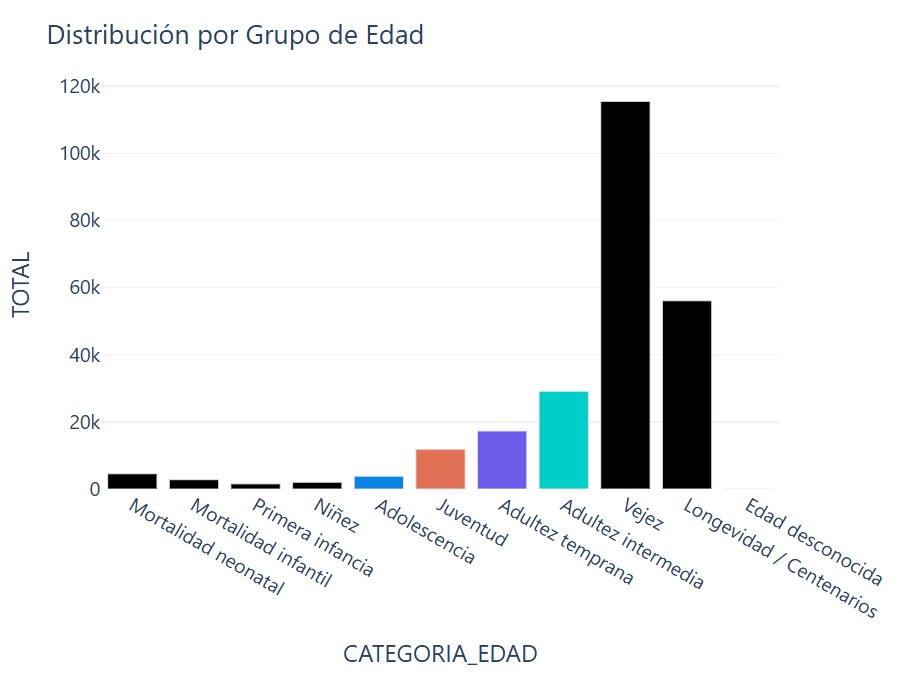
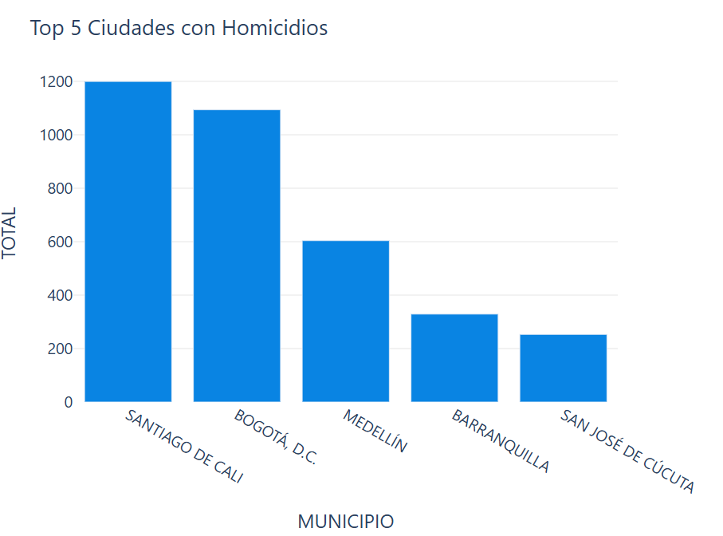
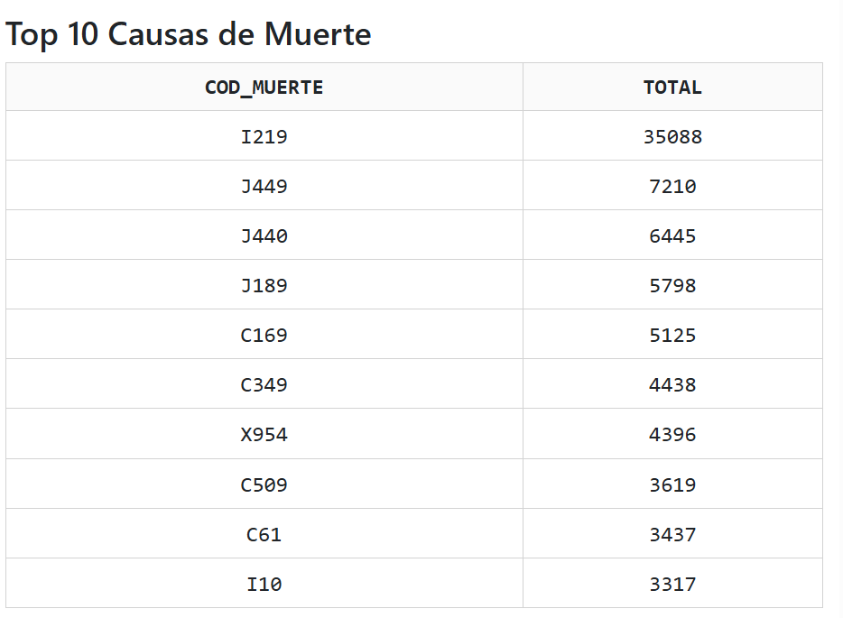

Introducción del proyecto

El presente proyecto consiste en el desarrollo de una aplicación web interactiva para el análisis de la mortalidad en Colombia durante el año 2019, utilizando herramientas de analítica y visualización de datos en Python.

La aplicación permite explorar información estadística mediante gráficos dinámicos, indicadores KPI y mapas interactivos, facilitando el análisis de patrones de mortalidad por sexo, departamento, edad y causas de muerte.

Objetivo

Desarrollar una aplicación web interactiva que permita visualizar y analizar datos de mortalidad en Colombia para el año 2019, apoyando la identificación de patrones relevantes mediante dashboards y gráficos interactivos.

Estructura del proyecto
mortalidad-dashboard/
│
├── app.py
├── requirements.txt
├── Procfile
├── .python-version
├── README.md
│
├── data/
│   ├── Anexo1.NoFetal2019_CE_15-03-23.xlsx
│   ├── Anexo2.CodigosDeMuerte_CE_15-03-23.xlsx
│   └── Divipola_CE_.xlsx
│
└── assets/
Descripción de archivos principales
app.py: Archivo principal de la aplicación Dash.
requirements.txt: Dependencias necesarias del proyecto.
Procfile: Configuración para despliegue en Render.
data/: Archivos de datos utilizados para el análisis.
README.md: Documentación del proyecto.
Requisitos
Librerías utilizadas
dash==2.17.1
dash-bootstrap-components==1.6.0
pandas==2.2.3
numpy==1.26.4
plotly==5.22.0
openpyxl==3.1.2
gunicorn==21.2.0
Flask==2.3.3
Werkzeug==2.3.7
requests==2.31.0
Versión de Python
Python 3.11.11
Despliegue en Render
Pasos realizados
Se creó un repositorio en GitHub.
Se cargaron los archivos del proyecto.
Se configuró un entorno virtual en Python.
Se generó el archivo requirements.txt.
Se creó el archivo Procfile con el siguiente contenido:
web: gunicorn app:server
Se agregó el archivo .python-version:
3.11.11
Se conectó el repositorio con Render.
Se desplegó la aplicación como Web Service.
Finalmente, se validó el correcto funcionamiento de la aplicación en la nube.
Software utilizado
Python
Dash
Plotly
Pandas
NumPy
Flask
Render
GitHub
Visual Studio Code
Instalación local
Clonar repositorio
git clone https://github.com/adrianafe8-cmd/-mortalidad-dashboard.git
Ingresar al proyecto
cd mortalidad-dashboard
Crear entorno virtual
python -m venv venv
Activar entorno virtual
Windows
.\venv\Scripts\activate
Instalar dependencias
pip install -r requirements.txt
Ejecutar aplicación
python app.py
Abrir navegador
http://127.0.0.1:8050
Visualizaciones y análisis de resultados
1. Distribución de muertes por departamento

El mapa interactivo permite visualizar la concentración de muertes por departamento en Colombia. Se evidencia una mayor concentración en departamentos con alta densidad poblacional como Bogotá, Antioquia y Valle del Cauca.

2. Total de muertes por mes

El gráfico de líneas permite identificar la evolución temporal de la mortalidad durante el año 2019. Se observaron variaciones mensuales que permiten identificar periodos críticos.

3. Mortalidad por sexo y departamento

El gráfico de barras apiladas muestra la distribución de muertes según sexo y departamento, permitiendo comparar diferencias entre regiones.

4. Distribución por grupos de edad

El histograma evidencia una mayor concentración de mortalidad en grupos etarios de adultez intermedia y vejez.

5. Top ciudades con homicidios

El gráfico permite identificar las ciudades con mayor cantidad de homicidios registrados durante el año analizado.

6. Tabla de principales causas de muerte

La tabla dinámica permite explorar las principales causas de muerte registradas en la base de datos, facilitando el análisis epidemiológico.

Conclusiones

La aplicación desarrollada permite integrar analítica de datos y visualización interactiva en una solución web accesible desde internet. El uso de Dash y Plotly facilitó la creación de dashboards dinámicos y Render permitió realizar el despliegue en un entorno PaaS de forma eficiente.